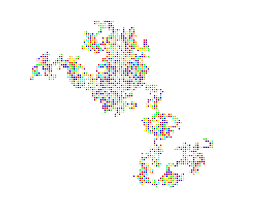

1. El experimento que quería realizar era saber si agregaba otros "Walkers" al código estos, al ser todos dependientes de el método step(), iban a moverse
hacia una misma dirección e iba a parecer que solo había un walker o si iban a tomar comportamientos independientes.

2. Quería saber si al crear sistemas con distintos objetos (pero con el mismo constructor) era necesario usar distintos métodos para randomizar sus comportamientos.

3. Esperaba que no se comportaran de la misma manera y efectivamente tomaran caminos separados los diferentes objetos creados.

4. El resultado que obtuve era el esperado.
   
5. Indagado con ChatGPT sobre este experimento que quería realizar le pregunté qué podía hacer si quería que todos tuvieran el mismo comportamiento. Aprendí entonces
que a cada walker debía pasarle el mismo parámetro "choice" de la función step(). Además reconocí que puedo también randomizar otros elementos para cada objeto que cree
y hacerlos independientes: el color, por ejemplo.

```js

let walker;
let walker2;
let walker3;
let walker4;

function setup() {
  createCanvas(640, 240);
  walker = new Walker();
  walker2 = new Walker();
  walker3 = new Walker(); 
  walker4 = new Walker(); 
  background(255);
}

function draw() {
  walker.step();
  walker.show();
  walker2.step();
  walker2.show();
  walker3.step();
  walker3.show();
  walker4.step();
  walker4.show();
  
  
  
}

class Walker {
  constructor() 
  {
    this.x = width / 2;
    this.y = height / 2;
  }

  show() {
   let colors = [
  color(255, 0, 0),    // Red (0)
  color(0, 255, 0),    // Green (1)
  color(0, 0, 255),    // Blue (2)
  color(255, 255, 0),  // Yellow (3)
  color(255, 165, 0),  // Orange (4)
  color(128, 0, 128),  // Purple (5)
  color(0, 255, 255),  // Cyan (6)
  color(255, 192, 203) // Pink (7)
  ];

    let choice = floor(random(8));
    let selectedColor = colors[choice];
    stroke(selectedColor);
    point(this.x, this.y);
  }
  
  

  step() {
    const choice = floor(random(4));
    if (choice == 0) {
      this.x+=1.5;
    } else if (choice == 1) {
      this.x-=1.5;
    } else if (choice == 2) {
      this.y+=1.5;
    } else {
      this.y-=1.5;
    }
  }
  
}
```


