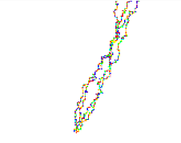

1. Una distribución uniforme es aquella en la que, usando por ejemplo la posibilidad como en el código pasado de que salgan números de 0 a 3, todos tienen la misma
posibilidad de salir. Una distribución no uniforme, como la que representa la función randomGaussian() es aquella en la que existe una media, y los valores posibles son
más probables cerca de la media y más improbables lejos de ella. A esto también puede añadirse otro parámetro que es el de la desviación. Mientras más alta sea la desviación
más frecuente serán los valores que aparezcan alejados de la media.

2.
 ```js
let walker;
let walker2;
let walker3;
let walker4;

function setup() {
  createCanvas(640, 240);
  walker = new Walker();
  walker2 = new Walker();
  walker3 = new Walker(); 
  walker4 = new Walker(); 
  background(255);
}

function draw() {
  walker.step();
  walker.show();
  walker2.step();
  walker2.show();
  walker3.step();
  walker3.show();
  walker4.step();
  walker4.show();
  
  
  
}

class Walker {
  constructor() 
  {
    this.x = width / 2;
    this.y = height / 2;
  }

  show() {
   let colors = [
  color(255, 0, 0),    // Red (0)
  color(0, 255, 0),    // Green (1)
  color(0, 0, 255),    // Blue (2)
  color(255, 255, 0),  // Yellow (3)
  color(255, 165, 0),  // Orange (4)
  color(128, 0, 128),  // Purple (5)
  color(0, 255, 255),  // Cyan (6)
  color(255, 192, 203) // Pink (7)
  ];

    let choice = floor(random(8));
    let selectedColor = colors[choice];
    stroke(selectedColor);
    point(this.x, this.y);
  }
  
  

  step() {
    const choice = floor(randomGaussian(0));
    if (choice == 0) {
      this.x++;
    } else if (choice == 1) {
      this.x--;
    } else if (choice == 2) {
      this.y++;
    } else {
      this.y--;
    }
  }
  
}
```

 

