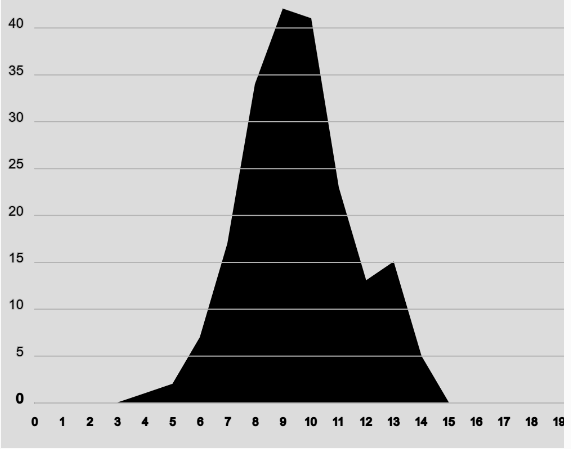

```js
let numbers = [];
let bins = new Array(20).fill(0); //Subdivisiones
let binSize = 1; 
let minRange = 0; 
let maxRange = 19; 

function setup() {
  createCanvas(500, 400);
  generateNumbers();
  countFrequencies();
  maxCount = max(bins); 
}

function draw() {
  background(220);
  drawGaussianCurve();
}

//Genera los números aleatorios y los añade al array numbers[]
function generateNumbers() {
  for (let i = 0; i < 200; i++) {
    let randNum = randomGaussian(10, 2);
    numbers.push(randNum);
  }
}

//Agrupa los números en las distintas frecuecias y los añade a la cuenta
function countFrequencies() {
  for (let i = 0; i < numbers.length; i++) {
    let index = floor((numbers[i]));
    bins[index]++; 
    }
}


function drawGaussianCurve() {
  let graphX = 30; 
  let graphWidth = width - 10; 
  let graphHeight = height - 50;
  let scaleFactor = graphHeight / maxCount; // Escala
  stroke(0);
  beginShape();

  //Se asegura de que el valor sea mostrado en el canvas
  for (let i = 0; i < bins.length; i++) {
    let x = map(i, 0, bins.length, graphX, graphX + graphWidth);
    let y = height - bins[i] * scaleFactor - 40;
    vertex(x, y);
  }
  endShape();

  for (let i = 0; i < bins.length; i++) {
    let x = map(i, 0, bins.length, graphX, graphX + graphWidth);
    let rangeLabel = (minRange + i * binSize).toFixed(0);
    fill(0);
    textAlign(CENTER);
    textSize(10);
    text(rangeLabel, x, height - 20);
  }

  for (let i = 0; i <= maxCount; i += 5) {
    let y = height - i * scaleFactor - 40;
    fill(0);
    textAlign(RIGHT);
    textSize(12);
    text(i, graphX - 10, y);
    stroke(180);
    line(graphX, y, graphX + graphWidth, y);
  }
}

```

Para el ejemplo grafiqué con ayuda de ChatGPT un diagrama que trazara una curva para poder visualizar la estrucura de la campana de Gauss en este tipo de distribución.


