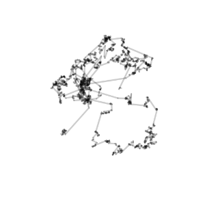

1. ¿QUÉ ES EL VUELO DE LEVY?

El vuelo de Levy es un tipo de caminata aleatoria en el que, como en los modelos que se usaron en los puntos anteriores, hay desplazamientos cortos y uniformes, 
pero a diferencia de los anteriores también hay una probabilidad de que se realicen grandes saltos. Este concepto me recordó a un juego llamado Plague Inc. en el que uno
era encargado de crear una enfermedad que acabara con todo el mundo, y las formas en que se propagaba la enfermedad era muy parecida a la manera en que se describe este 
modelo. El vuelo de Levy pienso que puede usarse para diferentes tipos de simulaciones procedurales con fines estéticos y visuales. En TouchDesigner por ejemplo, el usar
esta fórmula como base puede dar a elementos visuales un carácter mucho más dimámico e inesperado, lo cual, según las necesidades o el tipo de visual que se explore, puede
resultar muy interesante.

2. 

```js

 
  createCanvas(1080, 720);
  background(255);
  x = width / 2; 
  y = height / 2;
}

function draw() 
{
  let randNum = abs(randomGaussian());
  let levy = 1 / pow(abs(randNum), 1 / 1.5); //fórmula de levy
  let theta = random(TWO_PI); // Ángulo aleatorio
  let step = levy; // Longitud del paso
  
  // Descompone el paso en coordenadas
  let dx = step * cos(theta);
  let dy = step * sin(theta);

  stroke(0, 50);
  strokeWeight(2);
  line(x, y, x + dx, y + dy);
  //Actualizar la posición
  x += dx;
  y += dy;
  
}

```




