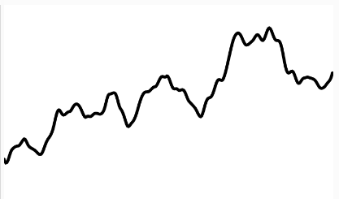
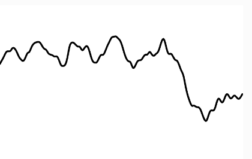

1. En la gráfica nos están mostrando la diferencia en el comportamiento entre el ruido Perlin y el ruido convencional. Ahí podemos ver que el ruido Perlin tiene un
comportamiento mucho más fluido y orgánico, a diferencia del ruido convencional en el que los cambios son muy bruscos y no hay una relación entre un valor generado y el
siguiente. En cambio, en el ruido Perlin el nuevo valor generado tiene una correlación con el último, y el nivel de variación dependerá del delta que se use.

2. Quise crear otro ruido Perlin para variar el grosor de la línea que también cambia con el ruido Perlin.

3. 
```js
let t = 0.0;
let varr_t = 0.0; // Variable global para el ruido del grosor

function setup() {
  createCanvas(360, 240);
}

function draw() {
  background(255);
  let xoff = t;  
  let varr = varr_t; // Inicializa el ruido del grosor con el tiempo global
  
  noFill();
  beginShape();
  
  for (let i = 0; i < width; i++) {
    let strokee = map(noise(varr), 0, 1, 1, 8); // Escalar el grosor entre 1 y 8
    strokeWeight(strokee);
    
    let y = noise(xoff) * height;
    xoff += 0.02;
    varr += 0.01; // Pequeño incremento para suavidad
    vertex(i, y);
  }

  endShape();
  t += 0.01;
  varr_t += 0.01; // Variación lenta del grosor con el tiempo
}

 ```




