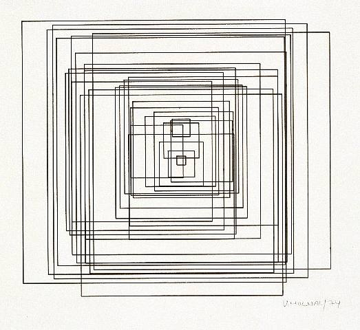

Generar una pieza de arte generativo algorítmico.
Debes usar al menos TRES conceptos.
El contenido generado debe ser interactivo. Puedes utilizar mouse, teclado, cámara, micrófono, etc, para variar los parámetros del algoritmo en tiempo real

Un texto donde expliques tu intención de diseño.
¿Cómo piensas usar los tres conceptos y por qué estos?
Reporta los referentes que usaste para inspirarte.

Mi diseño consta de un canvas en principio vacío en el que el usuario con una tecla puede añadir unos elementos. Puede añadir cuantos elementos quiera y la posición 
los nuevos elementos estará determinada por un ruido Perlin, según la posición del elememento anterior. Los tamaños de los elementos varían los unos de los otros según
una distribución uniforme. Se priorizan los tamaños pequeños pero existe también la posibilidad, menor, de que se generen elementos de mayor tamaño. 

Cuando el usuario crea que ha creado suficientes cuadrados puede presionar otra tecla y los elementos comenzarán a moverse independientemente según el vuelo de Levy.

Pensé el programa de esta manera porque vi una referencia y pensé entonces como podría usar los distintos conceptos para crear un efecto dinámico: es decir, los 
conceptos fueron los que determinaron el programa y cómo podría ser la interacción.

