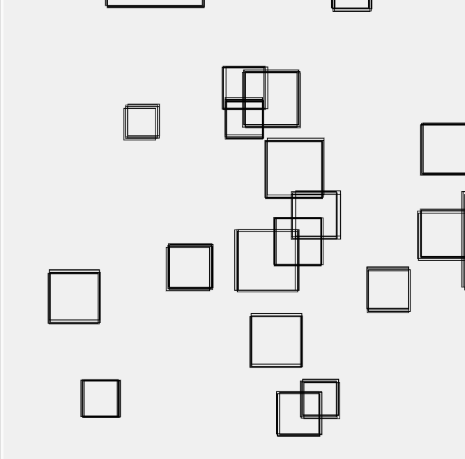
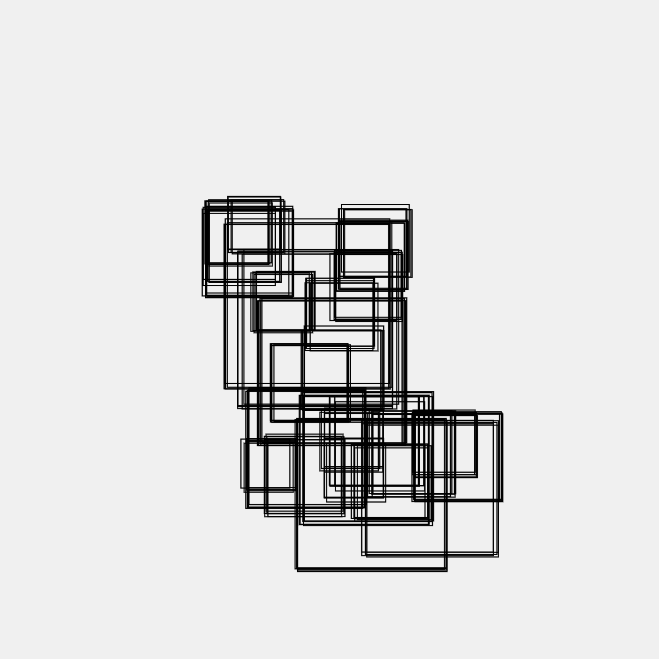
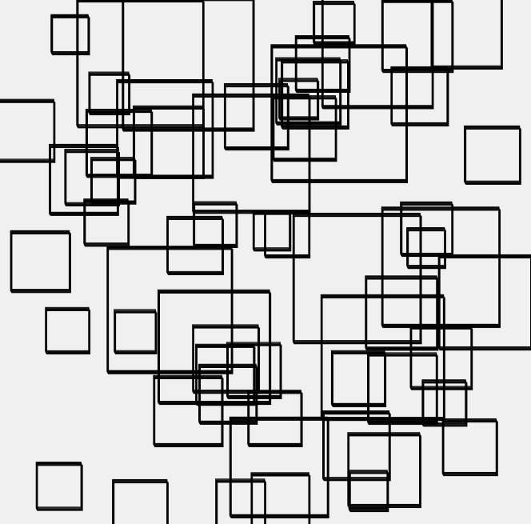

Código de la aplicación.
Captura del contenido generado.
En caso de realizar alguna variación al concepto original, escribe un texto donde expliques la razón del cambio.

```js
let squares = [];
let lines = [];
let noiseOffsetX, noiseOffsetY;
let moving = false;
let levyIntensity = 1;
let waveOffset = 0;

function setup() {
  createCanvas(600, 600);
  noiseOffsetX = random(1000);
  noiseOffsetY = random(1000);
}

function draw() {
  background(240);
  waveOffset += 0.05;
  
  for (let sq of squares) {
    sq.update();
    sq.display();
  }
  
  for (let ln of lines) {
    ln.update();
    ln.display();
  }
}

function keyPressed() {
  if (key === ' ') {
    let x = noise(noiseOffsetX) * width;
    let y = noise(noiseOffsetY) * height;
    
    let size = random() < 0.8 ? random(40, 80) : random(100, 150);
    
    squares.push(new SketchySquare(x, y, size));
    
    noiseOffsetX += 0.1;
    noiseOffsetY += 0.1;
  }
  
  if (key === 'o') {
    let x = noise(noiseOffsetX) * width;
    let y = noise(noiseOffsetY) * height;
    
    let size = random() < 0.8 ? random(40, 80) : random(100, 150);
    
    lines.push(new SketchyLine(x, y, size));
    
    noiseOffsetX += 0.1;
    noiseOffsetY += 0.1;
  }
  
  if (key === 's' && squares.length > 0) {
    squares.pop();
  }
  
  if (key === 'l' && lines.length > 0) {
    lines.pop();
  }
  
  if (key === 'w') {
    moving = !moving;
  }
  
  if (keyCode === UP_ARROW) {
    levyIntensity += 0.5;
  }
  
  if (keyCode === DOWN_ARROW) {
    levyIntensity = max(0.5, levyIntensity - 0.5);
  }
}

class SketchySquare {
  constructor(x, y, size) {
    this.x = x;
    this.y = y;
    this.size = size;
  }
  
  update() {
    if (moving) {
      let stepSize = (random(1) < 0.9 ? random(1, 5) : random(50, 100)) * levyIntensity;
      let angle = random(TWO_PI);
      this.x += cos(angle) * stepSize;
      this.y += sin(angle) * stepSize;
      
      this.x = constrain(this.x, 0, width - this.size);
      this.y = constrain(this.y, 0, height - this.size);
    }
  }
  
  display() {
    for (let i = 0; i < 5; i++) {
      let xOffset = sin(waveOffset + i * 0.2) * 5;
      let yOffset = cos(waveOffset + i * 0.2) * 5;
      noFill();
      stroke(0);
      rect(this.x + xOffset, this.y + yOffset, this.size, this.size);
    }
  }
}

class SketchyLine {
  constructor(x, y, size) {
    this.x = x;
    this.y = y;
    this.size = size;
  }
  
  update() {
    if (moving) {
      let stepSize = (random(0.01) < 0.2 ? random(1, 5) : random(50, 100)) * levyIntensity;
      let angle = random(TWO_PI);
      this.x += cos(angle) * stepSize;
      this.y += sin(angle) * stepSize;
      
      this.x = constrain(this.x, 0, width);
      this.y = constrain(this.y, 0, height);
    }
  }
  
  display() {
    for (let i = 0; i < 5; i++) {
      let xOffset = sin(waveOffset + i * 0.2) * 5;
      let yOffset = cos(waveOffset + i * 0.2) * 5;
      noFill();
      stroke(0);
      line(this.x + xOffset, this.y + yOffset, this.x + this.size + xOffset, this.y + this.size + yOffset);
    }
  }
}

```

## Antes de presionar 'W':



## Modificaciones:



Agregué la posibilidad de reducir manualmente la intensidad del salto de Levy. Lo hice para poder obtener en un mismo programa distintos resultados. Además de poder 
o añadir elementos mientras se está en el modo de movimiento.

